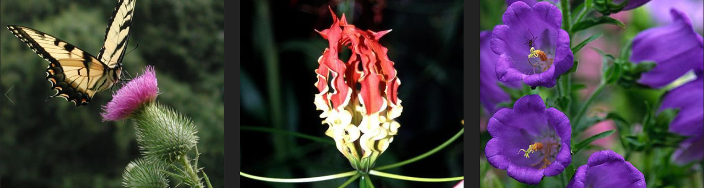
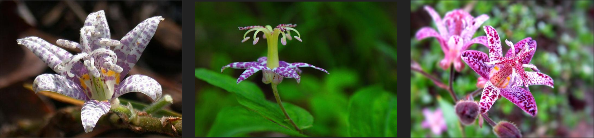
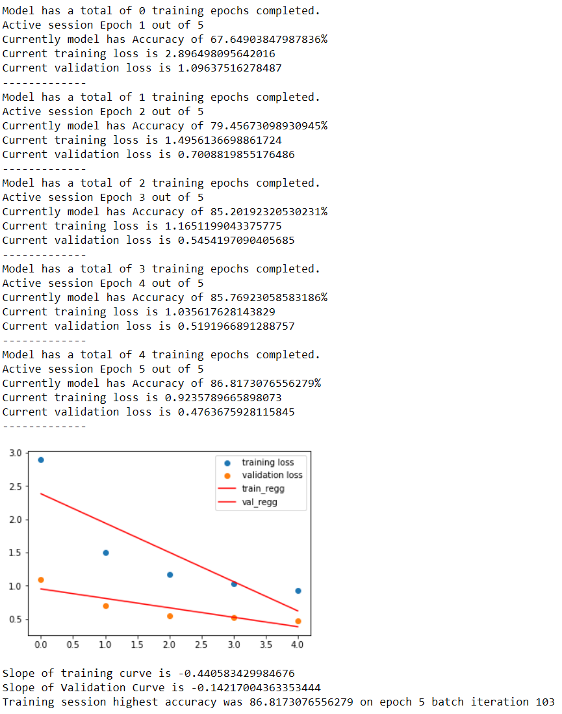
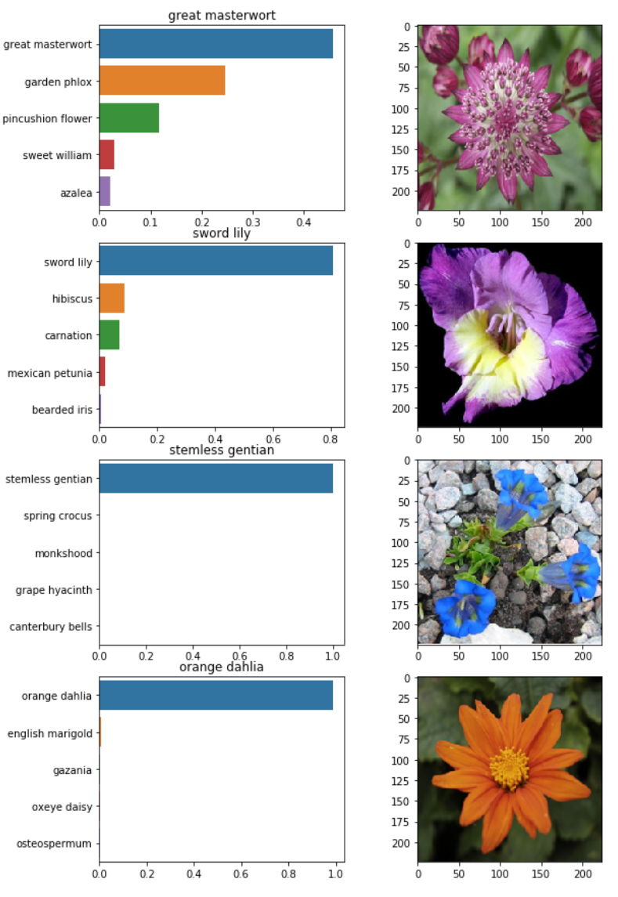
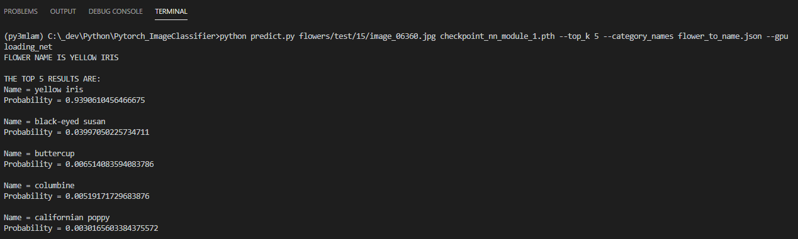
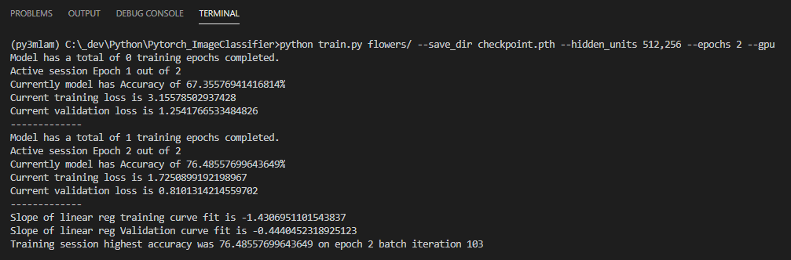

--------------------------------------------------------------
## Pytorch_ImageClassifier ##

This project builds a depp learning network to identify 102 different types of flowers. The dataset was obtained from the [102 category flowers dataset](http://www.robots.ox.ac.uk/~vgg/data/flowers/102/). While this specific example is used on this data, this model can be trained on any set of labeled images. Below are a few examples of the variability between classes and within the classes themselves.

<pre>
Spear Thistle                      Fire Lily                 Cantenbury Bells
</pre>





<center> Each of the 3 images is a Toad Lily</center> 

### 1. Developing the application ###
#### Load the data ####
```python
data_dir = 'flowers'
train_dir = data_dir + '/train'
valid_dir = data_dir + '/valid'
test_dir = data_dir + '/test'

params_dict = {'train': {'dir': train_dir, 'batch': 64, 'shuffle': True},
               'validate':{'dir': valid_dir, 'batch': 64, 'shuffle': True},
               'test':{'dir': test_dir, 'batch': 64, 'shuffle': False}}

datasets, dataloaders = Data_Utilities.generate_datasets(params_dict, list(params_dict.keys()))
```
#### Build and train network ####
```python
# check for gpu
device = torch.device('cuda' if torch.cuda.is_available() else 'cpu')
# network instance
neural_net = Net_Utilities.net_from_torchvision([1024,512], 102, 'relu', device, learn_rate = 0.001)
# train for 25 epochs
neural_net.train_network(dataloaders['train'], dataloaders['validate'], 5, plot = True)
```


#### Test the network ####
```python
# validate
loss, acc = neural_net.validate_network(dataloaders['test'])
print('acc on test is {} % \nloss is {}'.format(acc, loss))
```
<pre><code>
Output:
acc on test is 85.69240203270544% 
loss is 0.5390129307141671
</code></pre>

#### Saving the network ####
```python
# save the network checkpoint
neural_net.save_model_checkpoint('checkpoint_nn_module_1.pth', datasets['train'].class_to_idx)
```

#### Load the checkpoint ####
```python
# load it
loaded_net = Net_Utilities.load_neural_net('checkpoint_nn_module_1.pth', 'train')
```

#### Class Prediction ####
```python
results_dict = Net_Operations.predict(loaded_net, img_path, flowers_to_name)
for k,v in results_dict.items():
    print('{}:{}'.format(k, v))
```
<pre><code>
Output:
predicted_idx:[9, 62, 45, 85, 64]
classes:['yellow iris', 'black-eyed susan', 'buttercup', 'columbine', 'californian poppy']
idx_to_class:['15', '63', '48', '84', '65']
probabilities:[0.9390610456466675, 0.03997050225734711, 0.006514083594083786, 0.00519171729683876, 0.0030165603384375572]
</code></pre>

#### Check results ####
Display n number of images and their top k probabilities along with the actual image 



### 2. Command line application specifications ###
The project submission must include at least two files <code>train.py</code> and <code>predict.py</code>. The first file, <code>train.py</code>, will train a new network on a dataset and save the model as a checkpoint. The second file, <code>predict.py</code>, uses a trained network to predict the class for an input image.

* Train a new network on a data set with train.py

    * Basic usage: <code>python train.py data_directory</code>
    * Prints out training loss, validation loss, and validation accuracy as the network trains
    * Options:
        * Set directory to save checkpoints: 
            * <code>python train.py data_dir --save_dir save_directory</code>
        * Choose architecture: <code>python train.py data_dir --arch "vgg13"</code>
        * Set hyperparameters: 
            * <code>python train.py data_dir --learning_rate 0.01 --hidden_units 512 --epochs 20</code>
        * Use GPU for training: <code>python train.py data_dir --gpu</code>
        
* Predict flower name from an image with <code>predict.py</code> along with the probability of that name. That is, you'll pass in a single image <code>/path/to/image</code> and return the flower name and class probability.

    * Basic usage: <code>python predict.py /path/to/image checkpoint</code>
    * Options:
        * Return top K most likely classes: 
            * <code>python predict.py input checkpoint --top_k 3</code>
        * Use a mapping of categories to real names: 
            * <code>python predict.py input checkpoint --category_names cat_to_name.json</code>
        * Use GPU for inference: <code>python predict.py input checkpoint --gpu</code>
        
#### Test command line application ####
predict.py

train.py
